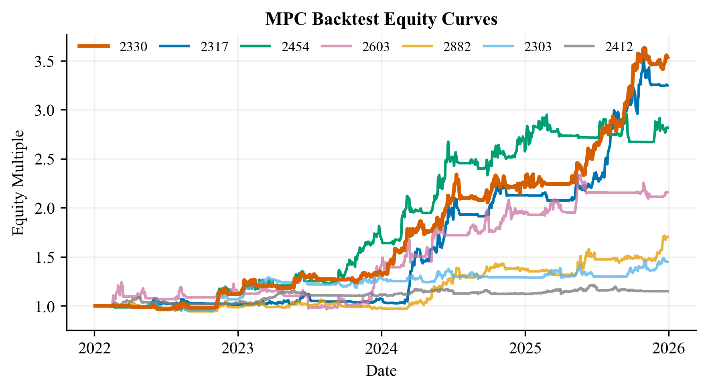
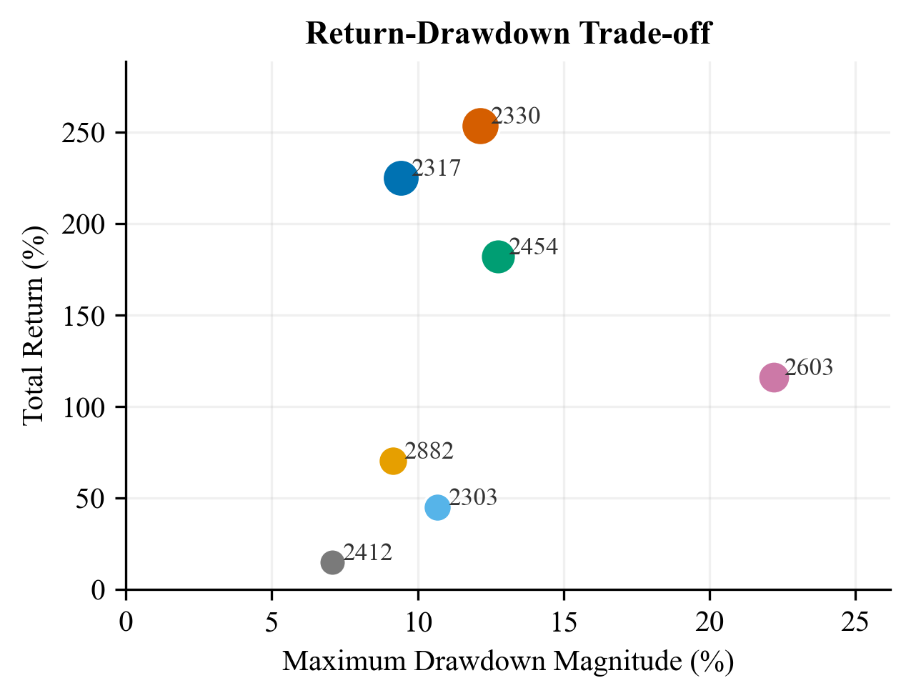
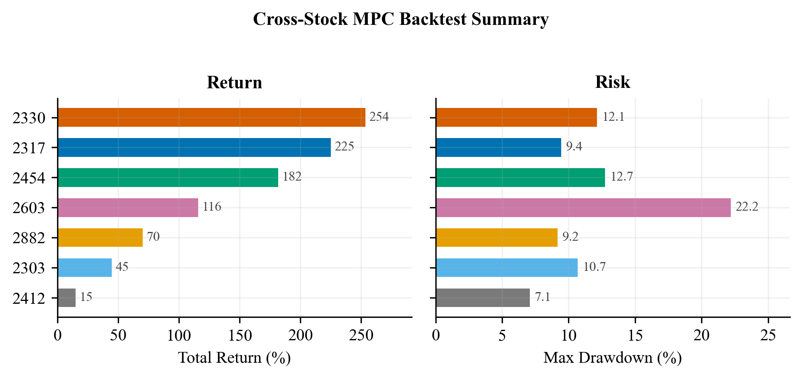

# Backtest Figures

Generated on 2026-06-05 from local backtest CSV outputs.

## Figure 1: Equity Curves



This figure compares normalized equity curves across the tested stocks. `2330`
is highlighted as the original reference case.

## Figure 2: Return-Drawdown Trade-off



The upper-left region is preferable: higher total return with lower drawdown
magnitude. In this run, `2317` is notable because it has high return and a
smaller drawdown than the other top performers.

## Figure 3: Metric Leaderboard



The left panel ranks total return, while the right panel shows maximum drawdown
magnitude. This makes it easier to compare performance and risk side by side.

## Reproduce

```powershell
$env:PYTHONPATH='src'
$env:MPLCONFIGDIR='figures/.mplconfig'
python -B figures/gen_fig_backtest_publication.py
```

